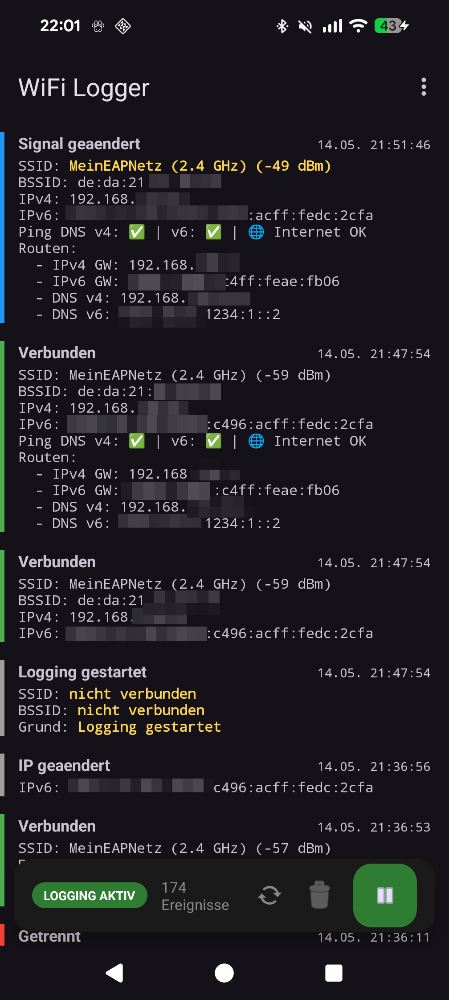

# 📡 WiFi Logger

Ein moderner, privatsphäre-orientierter WiFi-Monitor für Android, der Netzwerkwechsel, Signalstärken und Routing-Informationen in Echtzeit protokolliert.



## ✨ Features
- **Passives Logging:** Die App läuft im Hintergrund und protokolliert Ereignisse, ohne aktiv zu scannen (schont den Akku).
- **Detaillierte Netzwerk-Infos:** Erfasst IPv4, IPv6, Default Gateways und führt Gateway-Erreichbarkeitsprüfungen (Ping) durch.
- **Signal-Monitoring:** Protokolliert signifikante Änderungen der Signalstärke (RSSI).
- **Export:** Exportiere deine Logs als CSV-Datei zur weiteren Analyse.
- **Privacy First:** Keine Cloud, kein Tracking, keine Werbung. Alle Daten bleiben lokal in einer Room-Datenbank auf deinem Gerät.

## 🛠 Technische Details
- **Min SDK:** 26 (Android 8.0)
- **Target SDK:** 35 (Android 15)
- **Stack:** Kotlin, Room DB, Coroutines, Jetpack Lifecycle, Modern ConnectivityManager API.

## 🚀 Installation & Build
Um die App selbst zu bauen:
1. Repository klonen
2. In Android Studio öffnen oder via CLI bauen:
   ```bash
   ./gradlew assembleDebug
   ```

## 🔐 Berechtigungen
Die App benötigt folgende Berechtigungen für den vollen Funktionsumfang:
- `ACCESS_FINE_LOCATION`: Erforderlich, um die WLAN-SSID unter Android auszulesen.
- `POST_NOTIFICATIONS`: Für den Status-Service unter Android 13+.
- `FOREGROUND_SERVICE_LOCATION`: Erlaubt das Monitoring im Hintergrund.

## 📄 Lizenz
Dieses Projekt steht unter der [MIT Lizenz](LICENSE).
